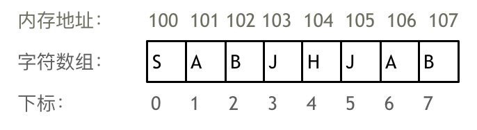
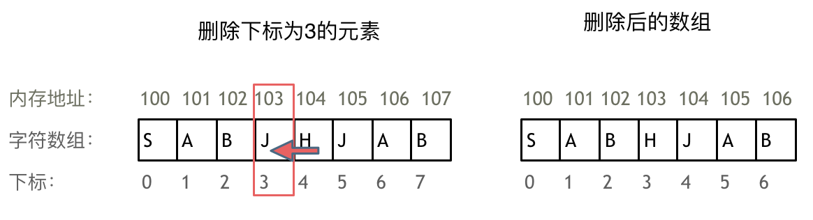
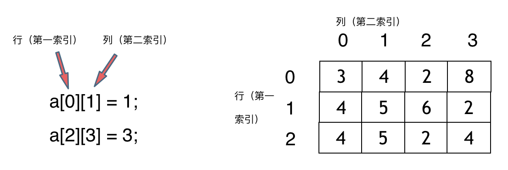
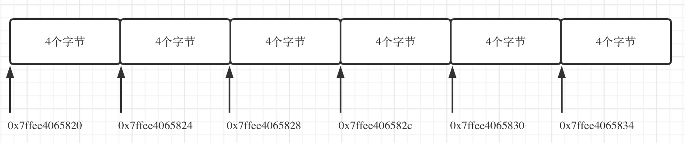
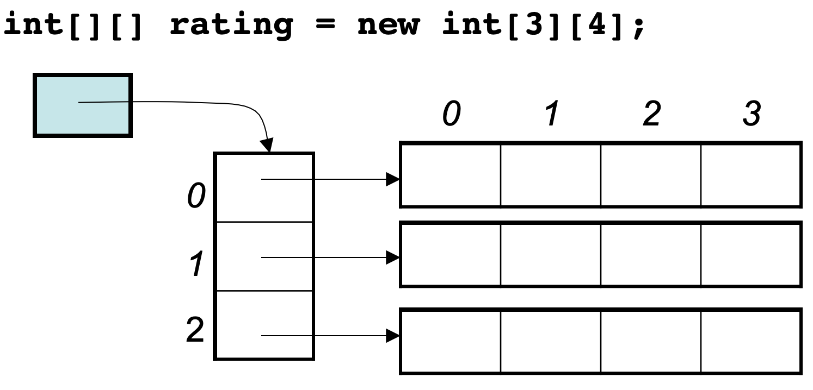

# 数组理论基础

数组是存放在连续内存空间上的相同类型数据的集合。数组可以方便的通过下标索引的方式获取到下标下对应的数据。
举一个字符数组的例子，如图所示：


需要两点注意的是：

-   数组下标都是从 0 开始的
-   数组内存空间的地址是连续的

**正是因为数组的在内存空间的地址是连续的，所以我们在删除或者增添元素的时候，就难免要移动其他元素的地址**

例如删除下标为 3 的元素，需要对下标为 3 的元素后面的所有元素都要做移动操作，如图所示：



如果使用 C++的话，要注意 vector 和 array 的区别，vector 的底层实现是 array，严格来讲 vector 是容器，不是数组。

**数组的元素是不能删的，只能覆盖。**

二维数组如图所示：


不同编程语言的内存管理是不一样的，以 C++为例，在 C++中二维数组是连续分布的。
可以用下面代码做一个实验，C++测试代码如下：

```c++
void test_arr() {
    int array[2][3] = {
        {0, 1, 2},
        {3, 4, 5}
    };
    std::cout << &array[0][0] << " " << &array[0][1] << " " << &array[0][2] << std::endl;
    std::cout << &array[1][0] << " " << &array[1][1] << " " << &array[1][2] << std::endl;
}

int main() {
    test_arr();
}

```

测试地址为：

```c++
0x7ffee4065820 0x7ffee4065824 0x7ffee4065828
0x7ffee406582c 0x7ffee4065830 0x7ffee4065834
```

注意地址为 16 进制，可以看出二维数组地址是连续一条线的。0x7ffee4065820 与 0x7ffee4065824 差了一个 4，就是 4 个字节，因为这是一个 int 型的数组，所以两个相邻数组元素地址差 4 个字节。0x7ffee4065828 与 0x7ffee406582c 也是差了 4 个字节，在 16 进制里 8 + 4 = c，c 就是 12。

如图：



**所以可以看出在 C++中二维数组在地址空间上是连续的。**

Java 是没有指针的，同时也不对程序员暴露其元素的地址，寻址操作完全交给虚拟机。所以看不到每个元素的地址情况，这里以 Java 为例，测试代码：

```Java
public static void test_arr() {
    int[][] arr = {{1, 2, 3}, {3, 4, 5}, {6, 7, 8}, {9,9,9}};
    System.out.println(arr[0]);
    System.out.println(arr[1]);
    System.out.println(arr[2]);
    System.out.println(arr[3]);
}
```

输出的地址为：

```Java
[I@7852e922
[I@4e25154f
[I@70dea4e
[I@5c647e05
```

这里的数值也是 16 进制，这不是真正的地址，而是经过处理过后的数值了，我们也可以看出，二维数组的每一行头结点的地址是没有规则的，更谈不上连续。

所以 Java 的二维数组可能是如下排列的方式：


